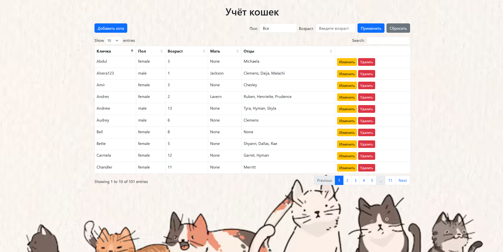

# 🐱 Laravel Cat Management System

Этот проект — система управления котами, разработанная на Laravel.  
Позволяет **добавлять, редактировать, удалять и фильтровать котов** по полу и возрасту.  
Использует **Yajra DataTables** для динамическогоотображения и фильтрации большого количевство данных.  

---


## Инструкция

Для начала вам нужно установить **Docker**.  
Если он уже установлен, выполните следующие шаги:

```bash
git clone https://github.com/feridrz/cat-management-system.git
cd cat-management-system
cp .env.example .env

docker-compose up -d --build
docker-compose exec app php artisan key:generate

docker-compose exec app composer install

docker-compose exec app php artisan migrate:fresh --seed
```


После запуска откройте в браузере 👉

```console
 http://localhost:8080/cats
```


